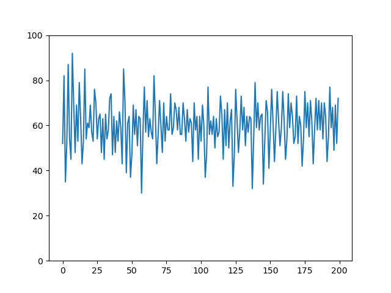
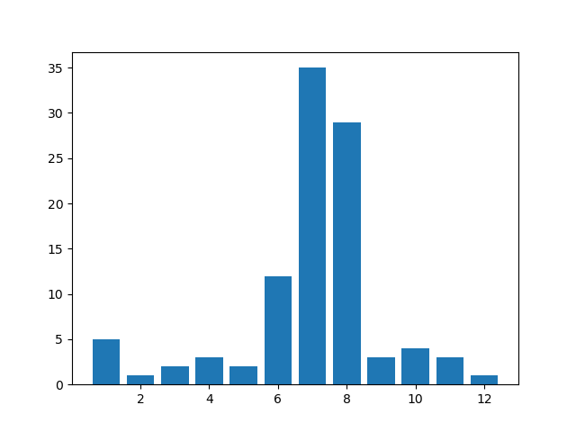

# El_Farol_Model

An implementation of [the El Farol model](http://tuvalu.santafe.edu/~wbarthur/elfarol.htm) by Arthur 1994.

## An example (200 trials)

Trajectory of number of costomer

Distribution of applied rules at the last trial
